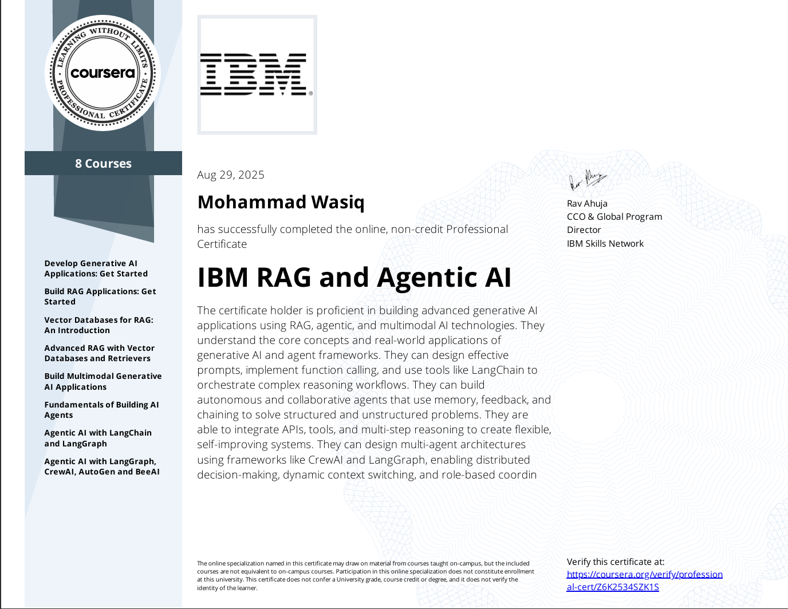

# [IBM RAG and Agentic AI](https://coursera.org/share/4effc27a3d05936547fee0b86bd2e707)

## Architecture

---
s

---

---
---

## Courses

### 1. Develop Generative AI Applications: Get Started

### 2. Build RAG Applications: Get Started

### 3. Vector Databases for RAG: An Introduction

### 4. Advanced RAG with Vector Databases and Retrievers

### 5. Build Multimodal Generative AI Applications

### 6. Fundamentals of Building AI Agents

### 7. Agentic AI with LangChain and LangGraph

### 8. Agentic AI with LangGraph, CrewAI, AutoGen and BeeAI

---
---

## Certificate

